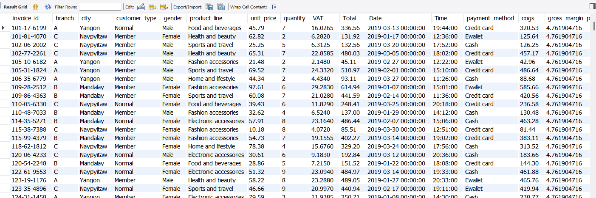

# Walmart Sales SQL Analysis

## 📊 Project Overview

This project focuses on analyzing Walmart sales data using SQL. The goal is to explore customer behavior, sales trends, product performance, and revenue patterns across different cities and branches.

The dataset includes transactional sales records with details such as product lines, customer types, payment methods, ratings, and financial metrics like revenue, VAT, and COGS.

---

## 🧾 Dataset Description

The dataset contains the following key fields:

* Invoice ID
* Branch
* City
* Customer Type (Member / Normal)
* Gender
* Product Line
* Unit Price
* Quantity
* VAT (Tax)
* Total Sales
* Date & Time
* Payment Method
* COGS (Cost of Goods Sold)
* Gross Income & Margin
* Customer Rating

---

## 🛠️ Technologies Used

* SQL (MySQL / PostgreSQL compatible)
* Excel (for initial data viewing and cleaning)
* Git & GitHub (version control)

---

## 🔍 Key Analysis Areas

### 1. General Insights

* Identified **3 cities** and mapped them to branches
* Yangon → Branch A
* Mandalay → Branch B
* Naypyitaw → Branch C

---

### 2. Product Analysis

* Total **6 unique product lines**
* Most selling product line: **Fashion Accessories**
* Highest revenue product line: **Food and Beverages**
* Product line with highest VAT: **Food and Beverages**

---

### 3. Revenue & Sales Trends

* **January** generated the highest revenue
* **January** also had the highest COGS
* **Naypyitaw** recorded the highest total revenue among cities

---

### 4. Customer Insights

* Most common customer type: **Member**
* Members generated the **highest revenue**
* Most common gender: **Male**
* Female preference: **Fashion Accessories**
* Male preference: **Health and Beauty**

---

### 5. Payment Behavior

* Most common payment method: **Cash**
* Other methods: Credit Card, E-wallet

---

### 6. Sales Performance

* Branch A sold more products than average
* Peak rating time: **Morning**
* Best average rating day: **Monday**

---

### 7. Tax & Profit Insights

* **Naypyitaw** has the highest average VAT
* Members contribute the most in total VAT

---

## 📌 Example SQL Queries

```sql
-- Total revenue by month
SELECT 
    month_name AS month,
    SUM(total) AS total_revenue
FROM sales
GROUP BY month
ORDER BY total_revenue DESC;

-- Most common payment method
SELECT payment_method, COUNT(*) 
FROM sales
GROUP BY payment_method;
```

Full query list available in project files. 

---

## 🚀 Key Takeaways

* Membership programs significantly boost revenue
* Product demand varies by gender and category
* Seasonal trends (January peak) impact revenue and cost
* City-level performance differs, with Naypyitaw leading
* Morning hours are critical for customer satisfaction

---

## 📁 Project Structure

```
├── data/
│   └── walmart_sales.csv
├── sql/
│   └── analysis_queries.sql
├── images/
│   └── dataset_preview.png
└── README.md
```

---

🎯 Conclusion

This project demonstrates how SQL can be used to extract meaningful business insights from raw transactional data. It highlights trends in customer behavior, product performance, and operational efficiency, making it a strong foundation for data analytics and business intelligence work.



---
